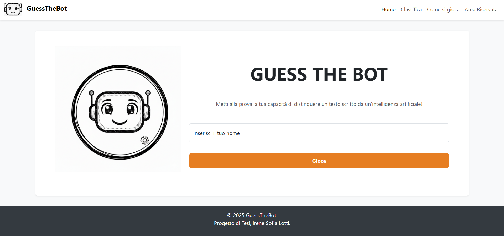
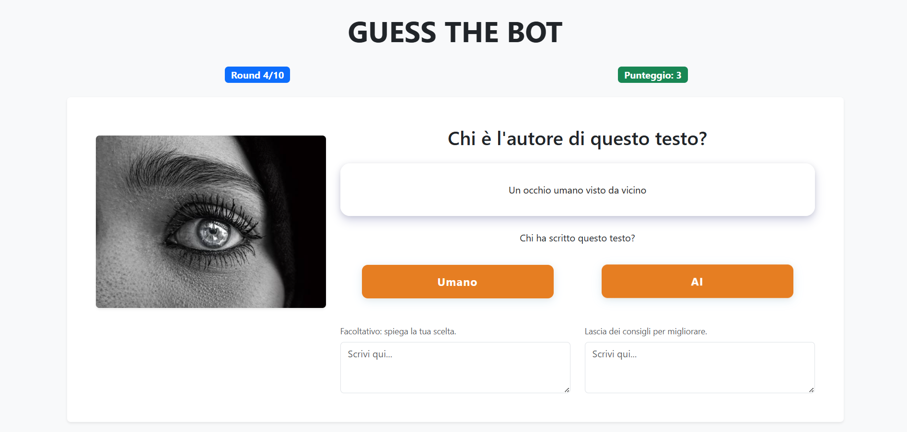
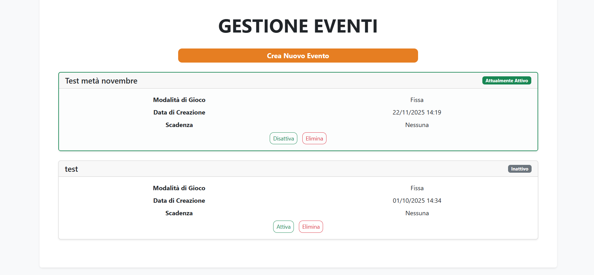
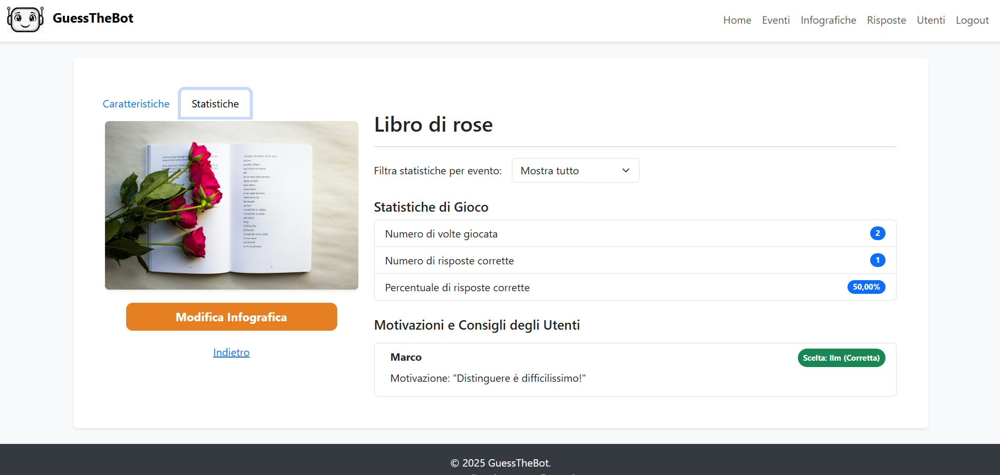

# Guess The Bot

[](README.md)
[](README.it.md)

*Read this in [Italian](README.it.md).*

## Project Description

Developed as a Bachelor's thesis project, this interactive web application aims to analyze users' ability to distinguish between text descriptions generated by humans and those generated by Large Language Models (LLMs).

The application presents users with a series of infographics, each accompanied by a description. The user must guess the origin of the text and, optionally, provide reasoning for their choice or feedback to improve the application. Results are collected to calculate a score and generate a participant leaderboard.

A restricted admin area is available, allowing for full customization of the gameplay experience.

| Username | Password |
| :--- | :--- |
| admin1 | password1 |
| admin2 | password2 |
| admin3 | password3 |

> **Note:** The application interface and content are currently in Italian.

## Tech Stack

* **Frontend**: HTML, CSS, Bootstrap, JavaScript
* **Backend**: PHP
* **Database**: MySQL
* **Server Stack**: Apache

## Local Setup

Follow these steps to run the application locally:

1.  **Clone the Repository**
    ```bash
    git clone [https://github.com/sofialottii/GuessTheBot.git]
    ```
2.  **Move the Repository**<br>
    Move the project folder inside your local server directory C:\xampp\htdocs.

3.  **Database Setup**<br>
    Open [phpMyAdmin](http://localhost/phpmyadmin/index.php?route=/), and select the **SQL** tab.
    Copy and paste the content of `db/GuessTheBotDatabase.SQL` into the query area and execute it. Then, do the same with `db/inserisciDati.SQL` to populate the database.

4.  **Start the App**<br>
    Open your browser and navigate to `http://localhost/GuessTheBot`.

## Screenshots

<p align="center">
  <b>Home</b><br>
  
</p>

<p align="center">
  <b>Game Loop</b><br>
  
</p>

<p align="center">
  <b>Events</b><br>
  
</p>

<p align="center">
  <b>Infographics Details</b><br>
  
</p>

## Author

* **Irene Sofia Lotti** - Ingegneria e Scienze Informatiche, UniBO
